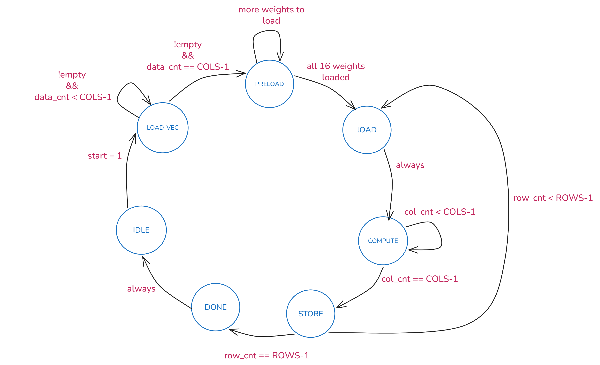

# INT8 neural network accelerator (FPGA)
 
A SystemVerilog hardware accelerator implementing a pipelined INT8 matrix-vector multiply unit with a full clock domain crossing (CDC) pipeline, verified end-to-end against a real PyTorch-trained MNIST classifier. Fully verified in simulation; synthesized on Cyclone 10 LP (Quartus Prime Lite stand-in for the Intel FPGA PAC N3000).
 
## Overview
 
This project implements a complete hardware/software pipeline for neural network inference:
 
- A pipelined INT8 matrix-vector multiply unit built from scratch in SystemVerilog
- An FSM controller that orchestrates FIFO draining, memory reads, computation, and result storage
- An async FIFO with Gray-coded pointers and 2-FF synchronizers for safe 100 MHz → 33 MHz clock domain crossing
- On-chip Block RAM for weights (pre-initialized from a hex file), input vectors, and outputs
- A single-layer MNIST digit classifier trained in PyTorch, quantized to INT8, and fed through the hardware
- Comprehensive self-checking testbenches at every level, including a bit-exact match against the Python reference
The hardware is scoped to a 4×4 matrix-vector multiply. A real PyTorch model was trained on MNIST and a 4-element slice of one trained classifier's weights and one real image's pixels were run through the hardware end-to-end — through the FIFO, across the CDC boundary, through the FSM and MAC pipeline — producing a result that exactly matches Python's quantized output. This is not a working full digit classifier, but it proves the entire pipeline — FIFO, CDC, FSM, MAC datapath, quantization, and hardware/software handoff — is correct using real numbers from a real trained model.
 
## Architecture
 
### System block diagram
 
```
External source (UART RX / testbench)
           │  wdata, write_en  [wclk: 100 MHz]
           ▼
   ┌───────────────┐
   │   Async FIFO  │  ← Gray-coded pointers, 2-FF sync, separate reset sync
   │  (CDC bridge) │
   └───────┬───────┘
           │  rdata, read_en   [clk: 33 MHz]
           ▼
   ┌───────────────┐
   │      FSM      │  IDLE → LOAD_VEC → PRELOAD → LOAD → COMPUTE → STORE → DONE
   │  (controller) │
   └───────┬───────┘
           │ addresses, enables
  ┌────────┼────────┐
  ▼        ▼        ▼
┌──────┐ ┌──────┐ ┌──────┐
│weight│ │vector│ │output│
│ BRAM │ │ BRAM │ │ BRAM │
└──┬───┘ └──┬───┘ └──▲───┘
   │        │        │
   ▼        ▼        │
┌────────────────────┴────┐
│  mat_vec_mul (pipelined) │
│  multiply → accumulate   │  2-cycle latency, 16 parallel INT8 multiplies
└─────────────────────────┘
           │
           ▼
      result[31:0], result_valid   ← exposed output port
```
 
### FSM state diagram
 
```
IDLE ──(start)──► LOAD_VEC ──(COLS bytes received)──► PRELOAD
                    ▲  │ stalls if FIFO empty              │
                    │  └───────────────────────────────────┘
                                                           │ (ROWS×COLS cycles)
                                                           ▼
                                         DONE ◄── STORE ◄── COMPUTE ◄── LOAD
                                          │         │ (loop per row)
                                          └──► IDLE
```
 
### FSM state diagram
 

 

- **IDLE** - Wait for start to go high 
- **LOAD_VEC** - Drain COLS bytes from async FIFO into vec_bram, one per cycle. Stalls (stays in state) if FIFO is empty.
- **PRELOAD** - Read full 4×4 weight matrix from weight_bram into mat_reg registers. Takes ROWS×COLS cycles.
- **LOAD** - Reset column counter. One cycle.
- **COMPUTE** -  Assert vec_ren/mat_ren, increment column counter. Assert valid_out when last column reached.
- **STORE** - Increment row counter. Return to LOAD for next row, or go to DONE if all rows complete.
- **DONE** - Assert done (2-cycle delayed to let MAC pipeline flush). Return to IDLE. 
## Performance (simulation)
 
| Metric | Value |
|---|---|
| Pipeline stages | 2 (multiply -> accumulate) |
| Latency | 2 clock cycles per row |
| Throughput | 1 matrix-vector multiply per clock cycle (once pipeline is full) |
| Data width | INT8 weights/inputs, INT32 accumulator |
| Matrix size | 4×4 |
| Clock frequency | not yet synthesized - simulation only |
 
## MNIST inference demo
 
A single linear layer (`nn.Linear(784, 10)`) was trained on MNIST in PyTorch, reaching **91.8–92.1% test accuracy**. Weights were quantized to INT8 using per-tensor symmetric scaling.
 
Hardware test: the digit-2 classifier's weights `[10, 12, 13, 1]` were run against the center 4 pixels of a real test image labeled "2" (`[127, 1, 68, -21]`).
 
```
Python reference: 2145
Hardware result[2]:2145   (exact match)
```
 
See `docs/mnist_inference_result.png` for the simulation output.
 
## Running the simulation
 
Requires Questa Intel FPGA Starter Edition (or any SystemVerilog-2012 capable simulator).
 
```bash
vlog -sv src/bram.sv src/fsm.sv src/mat_vec_mul.sv src/accelerator_top.sv tb/accelerator_top_tb.sv
vsim -c accelerator_top_tb -do "run -all; quit"
```
 
To retrain the model and regenerate the reference data:
 
```bash
python scripts/train_mnist.py
```
 
## Known limitations / scope
 
- 4×4 matrix size only - a real MNIST classifier needs 784 input features; this hardware demonstrates the math and pipeline on a representative slice, not full inference
- Simulation only - not yet synthesized to the target Intel FPGA PAC N3000
- Vector is re-read from BRAM on every row pass rather than cached, since it doesn't change between rows (a minor efficiency opportunity, not a correctness issue)
## Tools
 
- SystemVerilog (IEEE 1800-2012)
- Questa Intel FPGA Starter Edition / Icarus Verilog
- PyTorch + NumPy for training and golden reference
- Target board: Intel FPGA PAC N3000